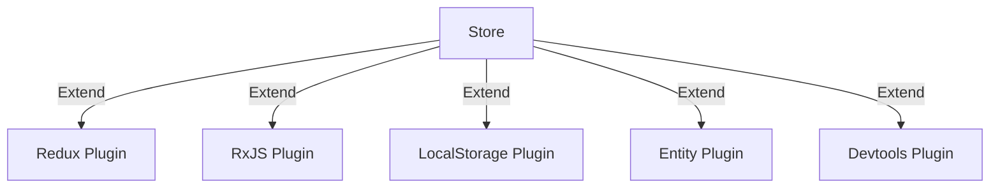

# StateBuilder


> [!WARNING]
>
> This library has been built for experimental purposes for my needs while building apps that need an
> agnostic state manager and a certain complexity.

[](https://www.npmjs.com/package/statebuilder)

`StateBuilder` is an agnostic state management library built on the top of SolidJS reactivity.

It's built to be an **extremely modular system**, with an API that allows you to add methods, utilities and custom
behaviors to your store in an easier way. Of course, this come with a built-in TypeScript support.

Solid already provides the primitives to build a state manager system thanks to signals and stores. What's missing is a
well-defined pattern to follow while building your application.

Thanks to `StateBuilder` you can **compose** the approach you like to handle your state. You can also use some patterns already exposed by the library.

## Table of contents

- [Architecture](#architecture)
- [Getting started](#getting-started)
- [Creating Plugins](#creating-plugins)
- [Usage in SolidJS](#usage-in-solidjs)

## Architecture

### **State container**

The state container it's a plain JavaScript object that collects all resolved store instances. Once created, every state
container will have it's own reactive scope, bound into a `Owner` from solid-js API.

### **Store definition creator**

The store creator it's the function that define the **store api** implementation, which requires you to follow a
specific signature to be complaint to `StateBuilder` API.

`StateBuilder` already have with two built-in store creators:

- defineStore
- defineSignal

Using the store definition, you can define your state business logic, which will be
**lazy evaluated** once the state is injected the first time.

### **Plugin**

Plugins are the **core** concept of `StateBuilder` composable system. They are configurable objects or
functions that override your store's signature, adding new features or modifying existing ones.

They can also be used to create mini-modules that can be reused across the app or other libraries.



## Getting started

### Installation

Install `StateBuilder` by running the following command of the following:

```bash
pnpm i statebuilder # or npm or yarn
```

### Enable compiler (Vite Only)

> [!NOTE]
>
> The statebuilder plugin is optional. This means that all the core features works right out of the
> box without a custom build step

If you're using Vite with SolidJS, you can use the `statebuilder` custom plugin, which provide debug and custom features through babel transforms.

- `dev`: Enable dev mode
- `autoKey`: Allows to name your stores automatically, based on the constant name.
- `stateProviderDirective`: Allows to wraps your SolidJS component into a StateProvider when they contains the `use stateprovider` directive.

```ts
import { defineConfig } from 'vite';
import { statebuilder } from 'statebuilder/vite';

export default defineConfig({
  // your vite config
  plugins: [
    statebuilder({
      autoKey: true,
      dev: true,
      filterStores: [
        // define your custom store name
      ],
      experimental: {
        transformStateProviderDirective: true,
      },
    }),
  ],
});
```

### Defining the store

Define the store state through the definition creator function, such as `defineStore` or `defineSignal`.
Those utilities wrap under the hood the [createSignal](https://www.solidjs.com/docs/latest#createsignal)
and [createStore](https://www.solidjs.com/docs/latest#createstore)
primitives from SolidJS, but they will be lazy initialized once the state is injected the first time.

```ts
// count.ts
import { defineSignal } from 'statebuilder';
import { createEffect } from 'solid-js';

const CountStore = defineSignal(() => 0)
  .extend((state) => ({
    increment: () => state.set((prev) => prev + 1),
    decrement: () => state.set((prev) => prev - 1),
  }))
  .extend((state) => {
    createEffect(() => {
      console.log('on state change', state());
    });
  });
```

Note that first argument is an arrow function that defines the initial value of the state.
Next, you can extend your store definition with the `.extend()` method, which is typesafe and chainable, allowing
you to use multiple plugin at once.

### Creating the `Store container`

The state can be injected through the `Container`. Each container collects stores as singletons, so once it is mounted,
the same instance of the store will be shared across it's boundaries.

```ts
// container.ts
import { Container } from 'statebuilder';
import { createRoot } from 'solid-js';

export const stateContainer = createRoot(() => Container.create());

const count = stateContainer.get(CountStore);

count(); // get the state accessor

count.set((count) => count++); // set the state manually

// The returned state will inherit all properties returned by the .extend() method 😁

count.increment(); // increment;

count.decrement(); // decrement;
```

> [!WARNING]
>
> Currently the most safe way to create a Container in solid-js is using context, in order to fully support
> SSR mode and avoid global state pollution.
>
> [Read more about solid-js integration](#usage-in-solidjs)

## Creating plugins

As already said in the [Architecture](#architecture) paragraph, `StateBuilder` core is powered by a pluggable system.

Plugins can be defined in two ways:

- Through a function that extends the store object
- Through a `Plugin` configuration object

The first recommendation is to split your store extension in plugins where needed, for example
when you have to reuse some business logic, and prefers the `makePlugin` API when you create generic plugins (
e.g. `LocalStoragePlugin`), in order to simplify the TS typings.

### Defining plugins through simple functions

```ts
import { createEffect, on } from 'solid-js';

const CountStore = defineSignal(() => 0).extend((state) => {
  if (localStorage.has('count')) {
    state.set(JSON.parse(localStorage.get('count')));
  }

  createEffect(on(state, (count) => localStorage.set('count', count)));

  return {
    increment: () => state.set((prev) => prev + 1),
    decrement: () => state.set((prev) => prev - 1),
  };
});
```

### Splitting plugins with `makePlugin`

In the plugin created earlier, we could split the logic into two different plugins:

- A plugin which updates the localStorage on state change
- A plugin which augments the state with the state methods

```ts
import { makePlugin } from 'statebuilder';

const withLocalStorage = (key: string) =>
  makePlugin(
    (state) => {
      // Will be called once during state initialization
      if (localStorage.has(key)) {
        const value = JSON.parse(localStorage.get(key));
        state.set(key);
      }

      createEffect(on(state, (count) => localStorage.set('count', count)));

      return {};
    },
    { name: 'withLocalStorage' },
  );

const CountStore = defineSignal(() => 0)
  .extend(withLocalStorage('count'))
  .extend((state) => {
    return {
      increment: state.set((prev) => prev + 1),
      decrement: state.set((prev) => prev - 1),
    };
  });
```

### Example with reducer

```ts
import { makePlugin } from 'statebuilder';

interface StoreWithReducer<T, Action> {
  dispatch(action: Action): void;
}

function reducerPlugin<T extends StoreValue, R>(
  store: Store<T>,
  reducer: (state: T, action: R) => T,
): StoreWithReducer<T, R> {
  return {
    dispatch(action: R) {
      store.set((prevState) => reducer(prevState, action));
    },
  };
}

export const withReducer = makePlugin(reducerPlugin, { name: 'withReducer' });
```

In the example above, we get the state context, a reducer and we return a new object with a dispatch function that will
update the store thanks to the `.set()` method.

Here is an example of what we have created.

```tsx
import { defineStore, provideState } from 'statebuilder';

type Increment = { type: 'increment'; payload: number };

type Decrement = { type: 'decrement'; payload: number };

type AppActions = Increment | Decrement;

type AppState = {
  counter: number;
};

function appReducer(state: AppState, action: AppActions) {
  switch (action.type) {
    case 'increment':
      return { ...state, counter: state.counter + action.payload };
    case 'decrement':
      return { ...state, counter: state.counter - action.payload };
    default:
      return state;
  }
}

const AppState = defineStore<AppState>(() => ({ counter: 0 })).extend(
  (context) => withReducer(context, appReducer),
);

function Counter() {
  const { get: state, dispatch } = provideState(AppState);

  return (
    <>
      <h1>Count: {state.counter}</h1>
      <button onClick={() => dispatch({ type: 'increment', payload: 1 })}>
        Increment
      </button>
      <button onClick={() => dispatch({ type: 'decrement', payload: 1 })}>
        Increment
      </button>
    </>
  );
}
```

## Usage in SolidJS

Before using `statebuilder` on SolidJS, it's recommended to mount the `StoreProvider` to your app, ideally at the root.
This is needed to fix an issue with node and SSR while using global state managers.

https://vuejs.org/guide/scaling-up/ssr.html#cross-request-state-pollution

The `StoreProvider` will manage all lifecycles and instances of your store. It act like a `Container`;

```tsx
import { StoreProvider } from 'statebuilder';

// Put in your root tree
<StoreProvider>
  <App />
</StoreProvider>;
```

Once your store definition is ready, you can inject the store in your components by using the `provideState` helper.

```tsx
import { provideState } from 'statebuilder';
import { CountStore } from './count';

function Counter() {
  const count = provideState(CountStore);

  return (
    <>
      <h1>Count: {count()}</h1>
      <button onClick={() => count.increment()}>Increment</button>
    </>
  );
}
```

## Built-in plugins

// TODO

- [statebuilder/commands](packages/state/src/plugins/commands): state management system with a command-event based approach
- [statebuilder/asyncAction](packages/state/src/plugins/asyncAction.ts): asynchronous actions handler with promise and
  observables
- [statebuilder/devtools](packages/state/src/plugins/devtools/): Redux devtools integration

## Demo / Examples

// TODO

- LocalStoragePlugin: https://github.com/riccardoperra/codeimage/blob/main/apps/codeimage/src/state/plugins/local-storage.ts
- EntityPlugin: https://github.com/riccardoperra/codeimage/blob/main/apps/codeimage/src/state/plugins/withEntityPlugin.ts
- IndexedDBPlugin: https://github.com/riccardoperra/codeimage/blob/main/apps/codeimage/src/state/plugins/withIndexedDbPlugin.ts

https://github.com/riccardoperra/codeimage/blob/main/apps/codeimage/src/state/editor/frame.ts
https://github.com/riccardoperra/codeimage/blob/main/apps/codeimage/src/state/presets/presets.ts
https://github.com/riccardoperra/codeimage/blob/main/apps/codeimage/src/state/presets/bridge.ts
