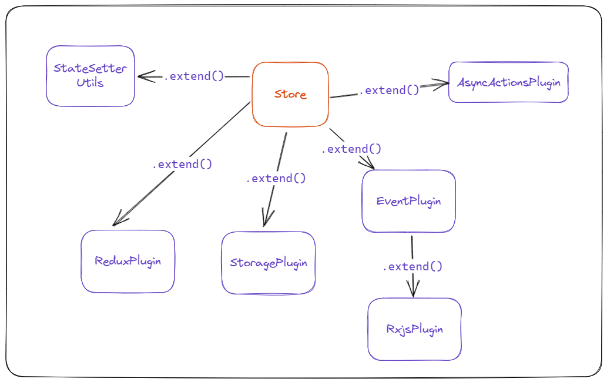

# statesolid

> **Warning** This library has been built for experimental purposes for my needs while building apps that need an
> agnostic state manager and a certain complexity.

[](https://www.npmjs.com/package/statesolid)

`statesolid` is an agnostic state management library built on the top of SolidJS reactivity.

It's built to be an extremely modular system, with an API that allows you to add methods, utilities and custom behaviors
in an easier way. Of course, this come with a built-in TypeScript support.

## Table of contents

// TODO

- [Architecture](#architecture)
- [Getting started](#getting-started)
- [Usage in SolidJS](#usage-in-solidjs)
- [Creating custom plugins](#creating-plugins)
- Creating custom stores

## Architecture

// TODO

Solid already provides the primitives to build a state manager system thanks to signals and stores. What's missing is a
well-defined pattern to follow while building your application.



With `statesolid` you can **compose** the approach you like to handle your state and reuse the behaviors across
all your system.

## Getting started

```bash
pnpm i statesolid # or npm or yarn
```

`statesolid` already come with some built-ins utilities to define states:

- defineSignal
- defineStore

Both utilities basically use under the hood the [createSignal](https://www.solidjs.com/docs/latest#createsignal)
and [createStore](https://www.solidjs.com/docs/latest#createstore)
primitives from SolidJS. The main difference is that the `define*` api deals only to defining how these store will be
created,
then they will only be initialized once the state is injected.

The state can be injected through the `StateContainer`, which will store all the states globally. Each container saves
stores as singletons, so once created the same instance of the definition will be shared.

```ts
// container.ts

import { Container } from 'statesolid';
import { createRoot } from 'solid-js';

export const stateContainer = createRoot(() => Container.create());
```

Once the Container is created, we can define a store through the `defineStore` or `defineSignal` function.

Both functions are used to define a store with a state. The first argument is the initial value of the state.
Next, you can extend your store definition with the `.extend()` method.

```ts
// count.ts

import { defineSignal } from 'statesolid';
import { createEffect } from 'solid-js';

const count = defineSignal(() => 0)
  .extend((state) => ({
    increment: () => state.set((prev) => prev + 1),
    decrement: () => state.set((prev) => prev - 1),
  }))
  .extend((state) => {
    createEffect(() => {
      console.log('on state change', state());
    });
  });
```

> **Note** The `.extend()` method is fully typesafe and chainable, allowing you to the use multiple plugin at once.

As anticipated, at the moment we have only defined the configuration of the store.
The next step is to initialize it using the container we created earlier.

```ts
// count.ts

import { stateContainer } from './container.ts';

const state = stateContainer.get(count);

state(); // get the state accessor

state.set((count) => count++); // set the state manually

// The returned state will inherit all properties returned by the .extend() method 😁

state.increment(); // increment;

state.decrement(); // decrement;

createEffect(() => {
  console.log('state changed', state());
});
```

## Usage in SolidJS

Before using `statesolid` on SolidJS, it's recommended to mount the `StoreProvider` to your app, ideally at the root.
This is needed to fix an issue with node and SSR while using global state managers.

https://vuejs.org/guide/scaling-up/ssr.html#cross-request-state-pollution

The `StoreProvider` will manage all lifecycles and instances of your store. It act like a `Container`;

```tsx
import { StoreProvider } from 'statesolid';

// Put in your root tree
<StoreProvider>
  <App />
</StoreProvider>;
```

Once your store definition is ready, you can inject the store in your components by using the `provideState` helper.

```tsx
import { provideState } from 'statesolid';
import { count as countState } from './count';

function Counter() {
  const count = provideState(countState);

  return (
    <>
      <h1>Count: {count()}</h1>
      <button onClick={count.increment}>Increment</button>
    </>
  );
}
```

## Creating plugins

As already said, `statesolid` core is powered by a pluggable system. Plugins are basically functions that take a state
context and return a new object with the props to merge.

// TODO

```ts
import { makePlugin } from 'statesolid';

interface StoreWithReducer<T, Action> {
  dispatch(action: Action): void;
}

export function withReducer<T extends StoreValue, R>(
  store: Store<T>,
  reducer: (state: T, action: R) => T,
): StoreWithReducer<T, R> {
  return {
    dispatch(action: R) {
      store.set((prevState) => reducer(prevState, action));
    },
  };
}
```

In the example above, we get the state context, a reducer and we return a new object with a dispatch function that will
update the store thanks to the `.set()` method.

Here is an example of what we have created.

```tsx
import { defineStore, provideState } from 'statesolid';

type Increment = { type: 'increment'; payload: number };

type Decrement = { type: 'decrement'; payload: number };

type AppActions = Increment | Decrement;

type AppState = {
  counter: number;
};

function appReducer(state: AppState, action: AppActions) {
  switch (action.type) {
    case 'increment':
      return { ...state, counter: state.counter + action.payload };
    case 'decrement':
      return { ...state, counter: state.counter - action.payload };
    default:
      return state;
  }
}

const appState = defineStore<AppState>(() => ({ counter: 0 })).extend(
  (context) => withReducer(context, appReducer),
);

function Counter() {
  const { get: state, dispatch } = provideState(appState);

  return (
    <>
      <h1>Count: {state.counter}</h1>
      <button onClick={() => dispatch({ type: 'increment', payload: 1 })}>
        Increment
      </button>
      <button onClick={() => dispatch({ type: 'decrement', payload: 1 })}>
        Increment
      </button>
    </>
  );
}
```

## Built-in plugins

// TODO

- [statesolid/commands](packages/state/src/plugins/commands): state management system with a command-event based
  approach using RXJS
- [statesolid/asyncAction](packages/state/src/plugins/asyncAction.ts): asynchronous actions handler with promise and
  observables

## Demo

https://github.com/riccardoperra/codeimage/blob/main/apps/codeimage/src/state/editor/frame.ts
